# 🚀 Transform Blockchain Data in 3 Simple Steps with SQL

**The fastest way to go from raw blockchain data to production-ready analytics**

Are you tired of wrestling with complex data pipelines? Ready to transform Aptos blockchain data without the overhead of heavyweight frameworks? Our SQL processing platform delivers enterprise-grade blockchain analytics through the power of simple, readable SQL.

---

## 🎯 **Stage 1: SELECT Your Data** 📊

**Simple visual interface - no SQL required**

```
┌─────────────────────────────────────────────────────────────┐
                    🚀 Data Source Setup                     
├─────────────────────────────────────────────────────────────┤
                                                             
        📊 Available Blockchain Data Sources:                      
                                                                    
        ✅ Aptos Transaction Logs        [●] Connected             
            └─ Real-time blockchain events                         
                                                                    
        ✅ Aptos Transaction Receipts    [●] Connected             
            └─ Event details and metadata                          
                                                                    
        ✅ Aptos Coin Registry           [●] Connected             
            └─ Token names, symbols, decimals                      
                                                                    
        ✅ Aptos FA Token Registry       [●] Connected             
            └─ Fungible asset metadata                             
                                                                    
    ┌─────────────────────────────────────────────────────┐  
        📈 Data Preview:                                      
        • 410 active pools discovered                        
        • 15,247 swap events (last 24h)                      
        • 892 unique tokens                                  
        • Real-time updates: ✅ Active                       
    └─────────────────────────────────────────────────────┘   
                                                                    
                [🔄 Refresh Data] [⚙️ Settings]                   
                                                             
└─────────────────────────────────────────────────────────────┘
```

### **Why Developers Love This Stage:**

**🎯 Zero Configuration**: Just click connect. No complex setup, no framework learning curve. All of Aptos is decoded and ready. 
Each module is templated and automatically put into SQL using streams.

**🤖 AI-Friendly Discovery**:
- **Instant Understanding**: AI can immediately see available data structures
- **Smart Suggestions**: Platform suggests relevant data combinations
- **Auto-Documentation**: Schema and relationships are automatically mapped
- **MCP Tool Use**: Live database accessible to AI to assist with changes


**⚡ Immediate AI Insights**:

AI scans the datasets and establishes:

```
📊 Quick Stats Available:
• 410 total pools across all DEXs
• Pool types: StandardPool, WeightedPool, StablePool
• Live swap events feeds
```

---

## 🔧 **Stage 2: PREPARE**

**Platform templates and generates streaming environment**

```mermaid
flowchart TD
    subgraph "📥 Raw Blockchain Data"
        A[🔗 Transaction Logs<br/>Messy, duplicated, complex JSON]
        B[📄 Event Receipts<br/>Mixed event types]
        C[🪙 Token Info<br/>Scattered across sources]
    end
    
    subgraph "🤖 Platform Auto-Processing"
        D[🧹 Smart Cleanup<br/>Removes duplicates automatically]
        E[🔍 Event Sorting<br/>Groups by type: swaps, pools, liquidity]
        F[📊 Data Structuring<br/>Converts messy JSON to clean tables]
    end
    
    G[🏷️ Decoded essential data]
    
    subgraph "✨ Clean, Ready Data"
        H[🏊 Pool Information<br/>Organized by type]
        I[💰 Trading Events<br/>Chronologically ordered]
        J[🎯 Token Metadata<br/>Names, symbols, decimals]
    end
    
    A --> D
    B --> E
    C --> F
    D --> G
    E --> G
    F --> G
    G --> H
    G --> I
    G --> J
    
    style A fill:#ffebee
    style B fill:#ffebee
    style C fill:#ffebee
    style D fill:#e8f5e8
    style E fill:#e8f5e8
    style F fill:#e8f5e8
    style G fill:#e8f5e8
    style H fill:#e3f2fd
    style I fill:#e3f2fd
    style J fill:#e3f2fd
```




### **What Happens Automatically (No Work For You):**

**🧹 Data Cleaning**:
- Deduplicating Writesets
- Fixes inconsistent formatting across different time periods

**🏷️ Smart Organization**:
- Automatically identifies different types of pools (standard, stable, weighted)
- Groups related transactions together chronologically
- Connects tokens with their proper names and decimal places


**✅ Results You Can Trust**:
```
📊 Preparation Complete:
✅ 410 unique pools (no duplicates found)
✅ 15,247 valid trading events (invalid ones filtered out)
✅ 892 tokens properly identified with metadata
```

This all performed automatically to avoid any potential issues with decoding or knowledge of ABIs, streaming, or state/data processing.

---

## 🌊 **Stage 3: STREAM Your Transformations**

**This is where you write code - sophisticated analytics with just 2 queries**

While the platform handles all event processing automatically, **you** write the high-level analytics transformations:

### **🎯 User Code #1: Pool Analytics**
```sql
-- YOUR CODE: Create enriched pool records with metadata
INSERT INTO pools (
    pool_address, timestamp, token0_name, token0_symbol, token0_decimals,
    token1_name, token1_symbol, token1_decimals, normalized_initial_amounts_0,
    normalized_initial_amounts_1, pool_type, pool_category
) WITH token_decimals AS (
    -- Smart token metadata prioritization
    SELECT address, decimals, name, symbol
    FROM (
        SELECT address, decimals, name, symbol, 1 as priority FROM aptos_fa_tokens
        UNION ALL
        SELECT from_hex(SUBSTR(SPLIT_PART(address, '::', 1), 3)),
               decimals, name, symbol, 2 as priority FROM aptos_coins
    ) QUALIFY ROW_NUMBER() OVER (PARTITION BY address ORDER BY priority) = 1
)
SELECT pool_creation_events.pool_address,
       token0.name, token1.name,
       -- Normalize amounts using token decimals
       amounts_0::DOUBLE / POW(10, token0.decimals) as normalized_initial_amounts_0,
       -- Intelligent pool classification
       CASE
           WHEN spr.stable_pool_address IS NOT NULL THEN 'StablePool'
           WHEN wpr.weighted_pool_address IS NOT NULL THEN 'WeightedPool'
           ELSE 'StandardPool'
       END as pool_category
FROM pool_creation_events
JOIN token_decimals token0 ON pool_creation_events.token_0_address = token0.address
JOIN token_decimals token1 ON pool_creation_events.token_1_address = token1.address
LEFT JOIN stable_pool_receipts spr ON pool_creation_events.pool_address = spr.stable_pool_address
```

### **🎯 User Code #2: Price Analytics**
```sql
-- YOUR CODE: Calculate trading prices with sophisticated normalization
INSERT INTO prices (
    traded_price, mid_price, normalized_amount_in, normalized_amount_out,
    direction, token0_name, token1_name, pool_category
) WITH normalized_swaps AS (
    SELECT s.*, p.token0_decimals, p.token1_decimals, p.pool_category,
           -- Smart amount normalization based on trade direction
           s.amount_in::DOUBLE / POW(10, CASE WHEN s.idx_in = 0 THEN p.token0_decimals
                                             ELSE p.token1_decimals END) as normalized_amount_in,
           s.pool_balance_0::DOUBLE / POW(10, p.token0_decimals) as normalized_balance_0
    FROM swap_events s JOIN pools p ON s.pool_address = p.pool_address
)
SELECT
    -- Intelligent price calculation handling edge cases
    CASE WHEN idx_in = 0 THEN normalized_amount_out / normalized_amount_in
         ELSE normalized_amount_in / normalized_amount_out END as traded_price,
    -- Weighted pool-aware mid-price calculation
    CASE WHEN pool_category = 'WeightedPool'
         THEN 1 / ((normalized_balance_0 * weight_1) / (normalized_balance_1 * weight_0))
         ELSE 1 / (normalized_balance_0 / normalized_balance_1) END as mid_price,
    CASE WHEN idx_in = 0 THEN 'BUY' ELSE 'SELL' END as direction
FROM normalized_swaps
```

Full source: `03_user_transforms.sql` which is less than 300 lines for the whole Thala Protocol.

### **Why This Stage Is Developer-Friendly:**

**🧠 High-Level Thinking**: You focus on business logic, not data plumbing
- **Token metadata joining**: Easy enrichment with standard datasets like coin/FA token data
- **Decimal normalization**: Handle 6, 8, 18-decimal tokens seamlessly
- **Pool type classification**: Intelligent categorization (Standard/Stable/Weighted)
- **Price calculations**: Sophisticated formulas with edge case handling

**⚡ Just 2 Queries For Complete Analytics**:
- **Query 1**: Pool metadata and enrichment (→ 410 enriched pools)
- **Query 2**: Trading price calculations (→ Real-time price feed)
- **Everything else**: Automated by the platform

**📊 Immediate Results**:

**Before** (Raw blockchain event):
```json
{
  "decoded": "{\"pool_obj\":{\"fields\":{\"inner\":\"253f970b6a6f071b5fb63d3f16ea2685431a078f62bf98978b37bd0d169ff7c5\"}},\"amount_in\":\"1000\",\"amount_out\":\"990\"}"
}
```

**After** (Analytics-ready data):
```sql
SELECT token0_name, token1_name, traded_price, direction, normalized_amount_in
FROM prices WHERE traded_price IS NOT NULL LIMIT 3;

-- Aptos Coin | TruAPT coin  | 1.0   | SELL | 0.000002 APT
-- Aptos Coin | Thala APT    | 5.0   | SELL | 0.00001 APT
-- Aptos Coin | TruAPT coin  | 0.995 | BUY  | 0.00000201 APT
```


---

## 💡 **The Bottom Line**

**Complex blockchain data doesn't require complex solutions.**

With SQL's universal syntax, AI-friendly patterns, and production-grade performance, you can focus on building analytics instead of wrestling with infrastructure.

